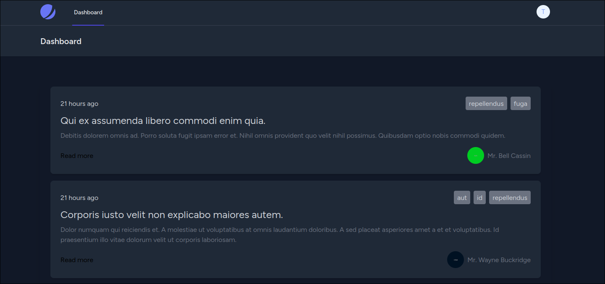

# API LOGAROO

<p align="center">
  
</p>

Esta API foi desenvolvida para fornecer funcionalidades de gerenciamento de postagens em um Sistema de Gerenciamento de Conteúdo (CMS).

## Documentação

Disponivel em: https://app.swaggerhub.com/apis/Clys-man/docs.logaroo/1.0.0

    Obs: Todas as requisições estão disponíveis no Insmonia, basta importar o aquivo ./docs/api-logaroo-insomnia.json

## Instalação

A aplicação é executada de forma simples em ambiente docker.

1. Clone o repositório

```
git clone https://github.com/clys-man/api-logaroo.git && cd api-logaroo
```

2. Instale as dependências via `composer`.

```
docker run --rm \
    -u "$(id -u):$(id -g)" \
    -v ".:/var/www/html" \
    -w /var/www/html \
    laravelsail/php83-composer:latest \
    composer install --ignore-platform-reqs
```

3. Crie o arquivo `.env`.

```
cp .env.example .env
```

4. Faça o deploy da aplicação.

```
sail up -d
```

<small>Em caso de erro: https://laravel.com/docs/11.x/sail#configuring-a-shell-alias</small>

3. Crie uma nova `APP_KEY` para a aplicação

```
sail artisan key:generate
```

4. Execute as migrations.

```
sail artisan migrate --seed
```

5. Acesse `http://localhost`
